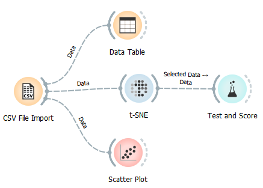
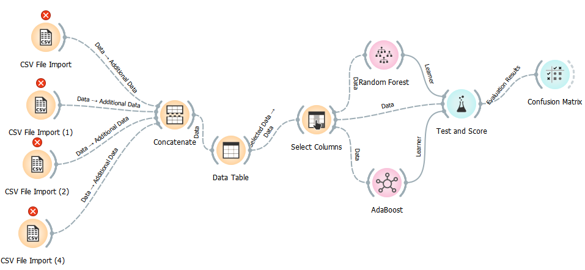

# Solution

## Phase 1
Approaches:
- most important features - scatter plot (Orange)
- correlation of features
- TSNE, MDS
- Manually set threshold
- Semisupervised learning with manually labeled instances

Final result: MSE ~ 0.4



## Phase 2
Approaches:
- AdaBoost
- RandomForest

```py
def create_model():
    path = './new_data2'
    dataset = merge_data(path)
    dataset.dropna(inplace=True)

    y = dataset["Target"]
    dataset.drop(['Target','ds'], axis='columns', inplace=True)
    X_train, X_test, y_train, y_test = train_test_split(dataset, y, test_size=0.3)

    fname = "new_model3"
    
    model = RF(n_estimators=4)
    model.fit(X_train.to_numpy(), y_train.to_numpy())
    y_pred = model.predict(X_test)
    print("Accuracy:", metrics.accuracy_score(y_test, y_pred))

    pickle.dump(model, open(fname, 'wb'))
```

Variatons of model accuracy: 0.76 - ~0.6


